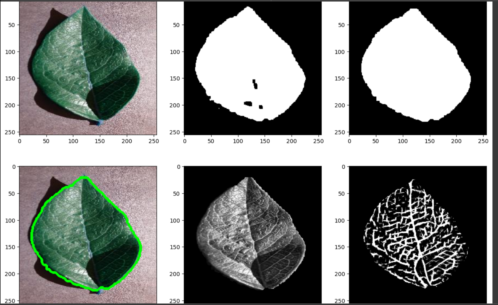
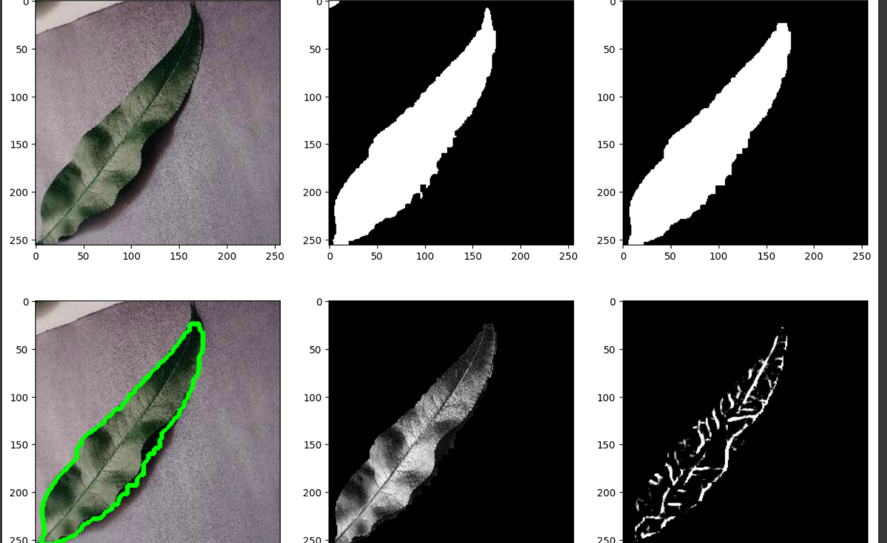

# cv-xavier-reese

### Part 1: Conceptual Design
My semester project idea is a program that recognizes trees on campus from images. If possible, I will expand it to recognizing a wider range of trees, say those found in Indiana or Northeast US. I like this project especially because I would enjoy and use a program like that myself. In order to train, validate, and test my model I will need a dataset of images. I have seen some good datasets online in limited research for leaves, and trees are not so unique that I think I will find trouble with getting large datasets of any image type that I choose. However, I will have to decide what types of images to use. I think with the use case of this program, I can require that all of the photos have the tree shown predominantly in the foreground, as people typically want to identify a tree that they are in front of in real life and can take a quality photo of in the moment. I will need to make sure that the program doesn't find difficulty in identifying the tree over a variety of backgrounds. If this proves too difficult, I could also pivot and focus on identifying trees by their leaves, which would allow for a better control of the background of photos taken.

To identify trees from a zoomed-out photo, things like overall shape, bark pattern and color, branch structure, leaf density, and more could be used as features for the program. There are some things that change with time for a tree, like leaf colors changing in the fall and leaves falling off in the winter. Depending on the final intended scope of my project, I can either expand it to include winter and fall photos or only summer photos. I know that it could considerably complicate the training of my model to include seasonal photos, but I don't know if it will make it ineffective. If I find good datasets for both options, I can compare the two models at different scopes of tree recognition.

No matter the scope of the program, I will have to detect the tree or leaf within the frame, and differentiate it from the background. The backdrop will often be trees or other plants, similar in color and shapes to the tree. The program will have to learn to ignore vegetation that is farther from the camera, blurrier or identifiable as not a tree by other characteristics (low to the ground, etc.)

Finally, I will tackle the program from both a CNN-based and non-deep-learning based approach and compare them.

So overall, this project will be about collecting a variety of datasets of both trees and possibly leaves, to analyze the power of computer vision to classify them during different seasons, and with larger or smaller geographical scopes. I don't expect to be able to write a program that recognizes world or country-wide trees without geographical input, but I'm interested to see how large I can push the scope of the program to be while maintaining a useful level of accuracy.

### Part 2: Data Acquisition

I found a database of images of 12 different types of leaves, with or without different diseases. It includes, however, a healthy dataset for each with 1000+ images. I will simply split these in a 60/20/20 fashion to create my training/testing/unknown datasets. This way there are no meaningful differences between the datasets for now.

https://data.mendeley.com/datasets/tywbtsjrjv/1

The photos are taken with a grey backgound, making the leaves very easy to distinguish. They are taken in high resolution and well-lit, although not always uniform. The database also uses six different augmentation techniques for increasing the data-set size. The techniques are image flipping, Gamma correction, noise injection, PCA color augmentation, rotation, and Scaling.

This dataset will allow me to create a model that recognizes leaves and has to account for differences in leaf structure. It also includes a folder of background images which don't include leaves, I assume so you can start to have your model recognize leaves over top of common backgrounds (cities, general greenery, dirt, roads, etc.) I'm not sure that this class will cover the skills needed to utilize this.

My original plan (see above) was to recognize trees on campus. I couldn't find a useful dataset of images for these specific tree species, so for now I am pivoting to the leaves that lend themselves to better datasets.

If my final goal remains to identify trees on campus, I would like to get a better dataset for my needs in the future. I plan to talk with Professor Czajka about just how many photos I would need to take of leaves from trees on campus. If it is possible, I'll take those images myself and then tweak my model to work for the new dataset, or perhaps take the photos before I even create the model.

### Part 3: Pre-Processing and Feature Extraction

NOTE: Collecting a large enough dataset of trees from campus became difficult because of fall break and the trees losing their leaves, as well as challenges in finding the time and techniques to take these photos. I am focusing on my original idea of leaves, since I will be able to refine my model-creation methods on a dataset found online, then turn it to photos from campus or other areas. I am also confident I can take many more photos of a variety of leaves than I can trees.

Before extracting features, my submitted iteration does the following to pre-process the image:
- convert image to hsv
- create mask over leaf using lower and upper bounds targeting green hues
- Remove stem and fill holes by performing a morphological open
- floodfill to remove any remaining holes

To get to this iteration, I tried many methods of creating the most accurate mask. I tried rgb bounds, otsu threshold over a grayscale image, and edge detection. Edge detection and grayscale performed the best of these, however I had two issues. Given the difference in backgrounds (something I want my final model to deal with), sometimes the grayscale threshold decided to include much of the background. Additionally, both segmentation methods had a lot of difficulty with the shadow. Shadows can change in thickness and color greatly between images, and the green did by far the best in avoiding this. However, I also developed a function to create a mask over the shadow of a leaf. This mask could be subtracted from the leaf+shadow detection to create a leaf. Despite that this method working pretty well, the hsv bounded detection worked nearly perfectly, so I went with that.

In the future, I'd like to adapt my model to work in less-controlled environments and year-round. To do this I could still revert to edge detection segmentation or adapt my hsv bounded detection to use a more adaptive threshold. For fall colored leaves, I could rely solely on edge detection or on separate bounds.

My model extracts the following features from the leaf images:
- leaf area and perimeter
- solidity
- major and minor axis length, and aspect ratio between them
- grayscale covariance matrix features: contrast, dissimilarity, homogeneity, energy, correlation, ASM
- Local Binary Pattern histograms
- gabor features: mean and standard deviation of binary image values after detection of texture (mostly veins)
- leaf color

To come up with this list of features, I combined my own original ideas with brainstorming with chatGPT. I found chatGPT to be extremely useful as a tool in this case. Instead of combing through documentation or stackoverflow questions for relevant features to extract using the sklearn or cv2 libraries, chatGPT pointed me twoard tracking solidity and other features of the convex hull, the grayscale covariance matrix, and local binary pattern histograms.

There are a few sections of features here. The first are about the general shape of the leaf. Area, perimeter, and major/minor axis comparison were easy to measure using contours and measure.regionprops. These are one clue to differentiating leaves, although in the future I will need to standardize them in relation to each other if I move to using my model outside of my original dataset and start using photos of different resolutions or with more/less of the frame being the leaf. In addition to these shape features I tracked solidity. Solidity is the ratio of pixels in the binary image compared to one of the convex hull of the leaf. This is useful because leaves with lobes or large ridges will be identified with a lower solidity value.

Secondly, I tried to extract details about the texture of the leaves. Some of these leaves are smooth, some are heavily textured. Some have a few small veins, some have many prominent ones. To extract this information, I found two pattern extraction techniques that could extract fine patterns and were new to me: grayscale covariance matrix and local binary pattern histograms. The first is a calculation of the variance of the surrounding pixels in grayscale. There is a whole suite of features to get from this matrix (see the list above). Graphing each of them shows variance between leaf classes, so I'm excited to see what the quality of my classifications will be based off of some of these. On the other hand, Local binary pattern matrices assign surrounding pixels a 1 or 0 depending on if they have a higher or lower value, then add together all of the values. This is useful because it is immune to changes in lighting or shadows that show up in the dataset. As long as the relative difference between the parts of the leaf remain visible the lbp histogram will look the same. Currently I am calculating the histogram for every image, which could have several features extracted from it in the future, such as average value or variance.

To extract information about larger, more visible textures I used gabor wavelet kernels. It took a lot of tweaking and grid searching to find parameters I was happy with, but now when I do several passes at different orientations I can bitwise or the results together and get a "skeleton" of the leaf like the one shown below. Because I remove the actual edges of the leaf, I am left with a representation of the veins that I can take information from. Currently that means finding the mean and standard deviation of the pixels within the leaf when converted to this skeleton.

Finally, I extracted the average hsv values of the leaf to compare colors, another descriptor that changes between leaf types.

